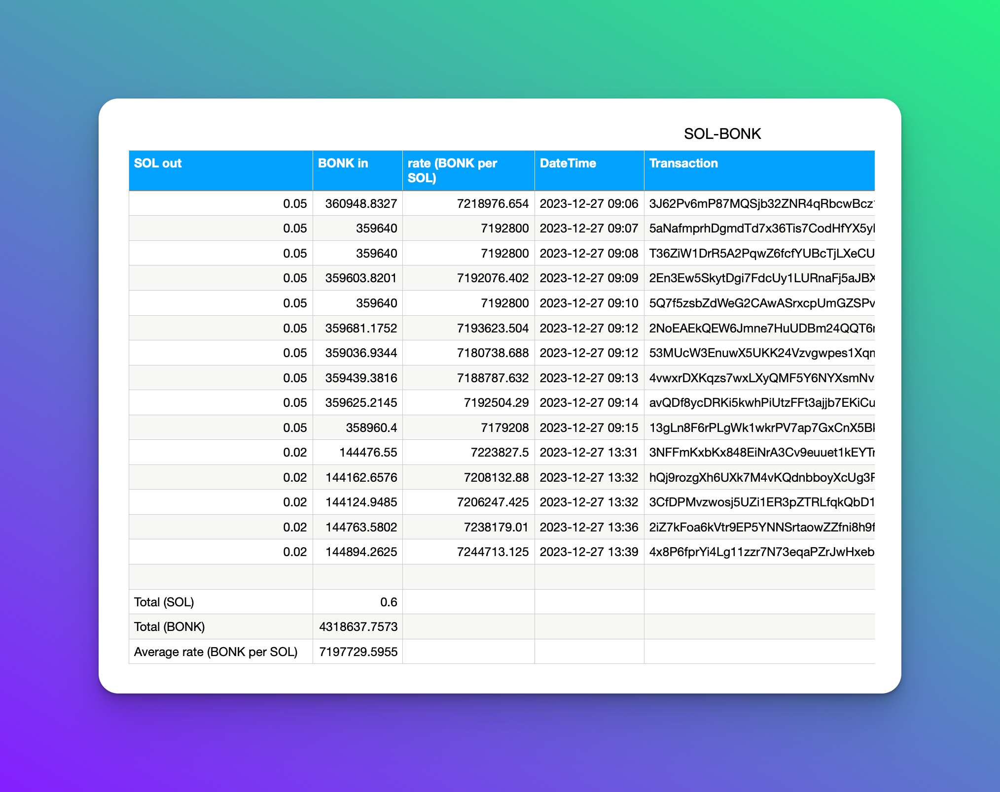
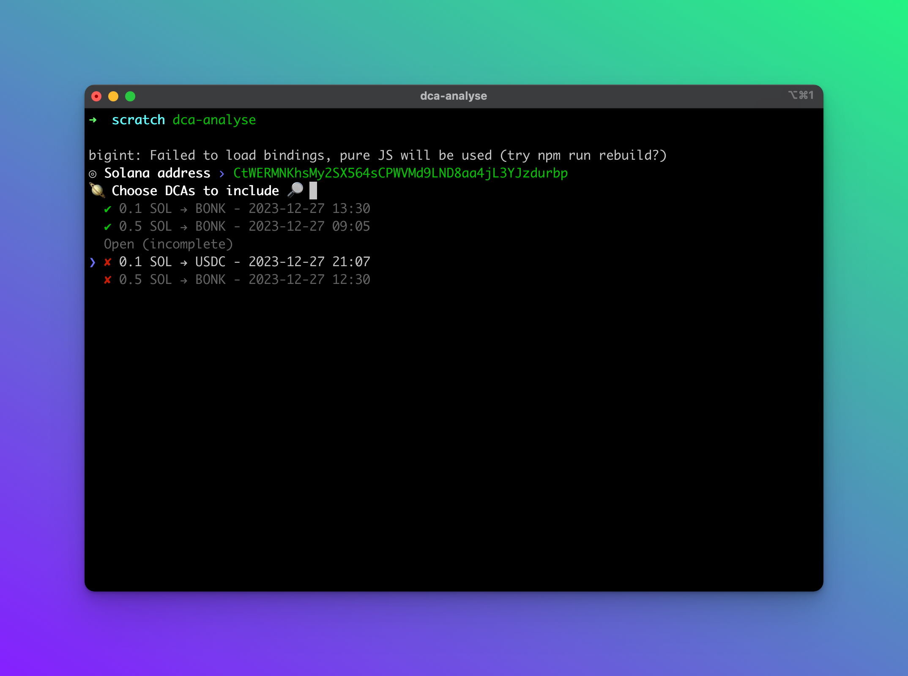
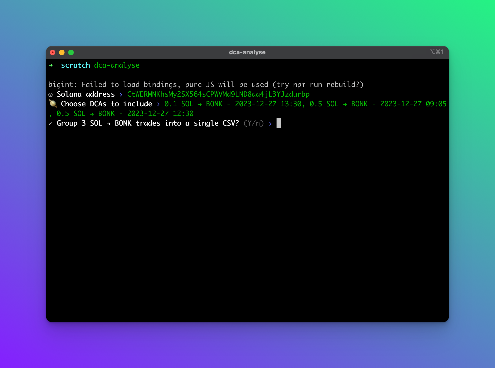

# Jupiter DCA Analyse

This repo contains a script to generate CSV files for
[Dollar-Cost Average (DCA)](https://station.jup.ag/guides/dca/how-to-dca) trades
on [Jupiter](https://jup.ag)

### Demo Video

https://github.com/mcintyre94/dca-analyse/assets/1711350/43baa554-8296-4891-8686-601b662cc6ce

### Example Output



### How it works

The script will fetch all your Jupiter DCAs, both closed and open (incomplete).
You can select which of these you'd like to download a CSV for.



If you select multiple with the same input and output token, you can choose
whether to download a CSV for each or a single CSV including the data for all of
them.



### Prerequisites

You will need to install Deno.
[See their website for instructions](https://docs.deno.com/runtime/manual/getting_started/installation)

You also need a Solana mainnet RPC. Note that
https://api.mainnet-beta.solana.com will not work. See
[Solana's RPC page](https://solana.com/rpc) for options with free tiers.

##### Install locally

You can install the script without downloading the repo, using `deno install`:

```sh
$ deno install --allow-read --allow-env --allow-sys=uid --allow-ffi --allow-net --allow-write https://raw.githubusercontent.com/mcintyre94/dca-analyse/main/src/dca-analyse.ts
```

##### Or, clone the repo

If you clone the repo you can use the included tasks.

```sh
# just run the script
$ deno task run

# or install it
$ deno task install
```

### Usage

First, set the `SOLANA_RPC_URL` environment variable:

```sh
$ export SOLANA_RPC_URL=https://your-rpc-here
```

If you don't set this then you'll be prompted for the RPC URL when you run the
script.

Then run the script:

```sh
$ dca-analyse
```

You'll be prompted for the wallet address to fetch DCAs for.

You can also pass the address in directly:

```sh
$ dca-analyse 7sh3me5291ifasiAMqCxSjnu7pF6PzJoMAGhBCPDxHp4
```
